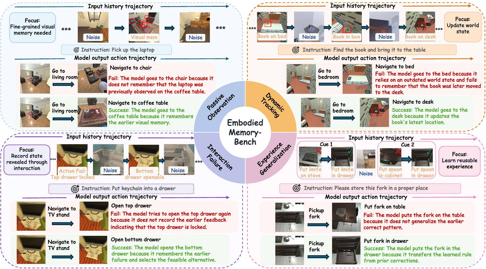
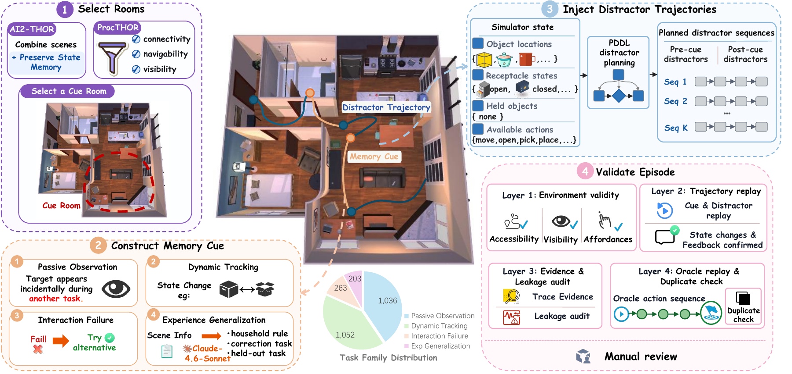
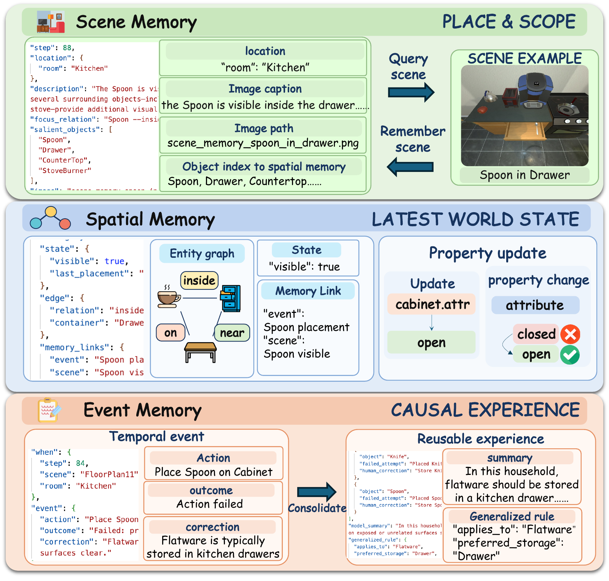

<div align="center">

<h1>
  
  <span>&nbsp;EmbodiedMemory-Bench</span>
</h1>

<hr>

<h2>EmbodiedMemory-Bench: Benchmarking Embodied Memory for Long-Horizon Embodied Tasks</h2>

<p>Lizhou Liang<sup>1</sup>, Xinyu Zhong<sup>2</sup>, Miao Pan<sup>1</sup>, Xiaohe Zhou<sup>1</sup>, Xuanyu Liu<sup>1</sup>, Qinfeng Li<sup>1</sup>, Peng Li<sup>3</sup>, Jintao Chen<sup>1</sup>, Xuhong Zhang<sup>1</sup>, Wenqi Zhang<sup>1</sup></p>
<p><sup>1</sup> Zhejiang University · <sup>2</sup> Central South University · <sup>3</sup> Institute of Software, Chinese Academy of Sciences</p>

<p>
  <a href="https://zju-omniai.github.io/EmbodiedMemoryBench/assets/paper.pdf"></a>
  <a href="https://zju-omniai.github.io/EmbodiedMemoryBench/"></a>
  <a href="https://huggingface.co/datasets/lzLiang/EmbodiedMemoryBench"></a>
  <a href="https://github.com/ZJU-OmniAI/Embodied-Omni/tree/main/embodied_memory"></a>
</p>

<p>
  <a href="pyproject.toml"></a>
  <a href="LICENSE"></a>
</p>

<p><em>Remember what the world was. Understand how it changed. Act beyond the moment.</em></p>

</div>

> **EmbodiedMemory-Bench is one project in the [Embodied-Omni](https://github.com/ZJU-OmniAI/Embodied-Omni) repository.** Run the commands below from the `embodied_memory/` directory after cloning the monorepo.

<p align="center">
  
</p>

## Overview

Long-horizon embodied agents must remember what they saw, what they changed, and what they learned from interaction. **EmbodiedMemory-Bench (EMem-Bench)** evaluates this ability through executable tasks: an agent first receives multimodal interaction history, then must build or retrieve memory and act in the environment to complete a later task.

The benchmark contains **2,554 episodes** across four complementary memory challenges. This repository provides the compact public implementation for benchmark construction, memory-system experiments, and evaluation. The data and model interfaces are documented below.

<div align="center">
  <video src="https://github.com/user-attachments/assets/13a1025d-c691-4b15-892d-ecc5544418c4" controls width="80%"></video>
</div>

## Benchmark

| Family | What it tests | Episodes |
|:--|:--|--:|
| **Passive Observation** | Retaining fine-grained visual details from prior observations | **1,036** |
| **Dynamic Tracking** | Updating memory when an object changes state or location | **1,052** |
| **Interaction Failure** | Recording state revealed by a failed or successful interaction | **263** |
| **Experience Generalization** | Transferring repeated corrections to a new object or scene | **203** |
| **Total** | Four executable task families | **2,554** |

The release spans **1,118 scenes**, **125 visible object types**, **83 target object types**, and **33 receptacle types**. Each task combines a grounded environment, historical interaction sessions, a task probe, and a legal action interface.

### Construction pipeline

<p align="center">
  
</p>

Episodes are generated from simulator-grounded scenes, checked for executable transitions, and represented through a frozen manifest. Candidate construction utilities are included in `emem_bench.construction`; generated candidates still require independent quality auditing before being added to a release.

## Embodied-Memorizer

The repository also includes **Embodied-Memorizer (EMem)**, a lightweight external memory controller that organizes embodied experience into spatial, event, scene, and consolidated experience records.

<p align="center">
  
</p>

EMem supports a model-controlled loop:

```text
historical observations
        ↓
context ingestion and memory writes
        ↓
spatial / event / scene / experience queries
        ↓
observation-grounded action sequence
        ↓
visible execution feedback and online updates
```

The public implementation provides transparent, representative experiments with a compact memory controller and an inspectable evaluation protocol.

## Quick start

### Install

```bash
git clone https://github.com/ZJU-OmniAI/Embodied-Omni.git
cd Embodied-Omni/embodied_memory
python -m pip install -e .
```

Run the dependency-free memory demo:

```bash
emem
```

For simulator-backed evaluation and Hugging Face downloads:

```bash
python -m pip install -e '.[sim,hub]'
```

AI2-THOR requires its own rendering dependencies and a working graphics driver.

## Data

The complete 2,554-episode benchmark is available on [Hugging Face](https://huggingface.co/datasets/lzLiang/EmbodiedMemoryBench). Install the `hub` extra and download the dataset:

```bash
emem-bench download --repo-type dataset \
  --repo-id lzLiang/EmbodiedMemoryBench \
  --local-dir ../EmbodiedMemoryBench-Data
```

The downloaded dataset uses the following layout:

```text
EmbodiedMemoryBench-Data/
├── manifests/full2554.jsonl
├── manifests/<family>.jsonl
└── episodes/<family>/<episode>/
```

Set the data root and manifest before running an experiment:

```bash
export EMEM_DATA_ROOT="/path/to/EmbodiedMemoryBench-Data"
export EMEM_MANIFEST="$EMEM_DATA_ROOT/manifests/full2554.jsonl"

emem-bench inspect \
  --data-root "$EMEM_DATA_ROOT" \
  --manifest "$EMEM_MANIFEST" \
  --all
```

The loader checks that manifest paths stay inside the data root and verifies episode hashes when they are present. Dataset paths are resolved from the configured data root.

## Evaluation

The public runner supports two representative modes:

| Mode | Description |
|:--|:--|
| `full_context` | A served model receives the serialized historical context and current environment observation. |
| `emem` | A served model writes to and queries Embodied-Memorizer before selecting grounded actions. |

Start with one episode per family:

```bash
export EMEM_API_KEY="..."  # only when the serving endpoint requires it

emem-bench evaluate \
  --data-root "$EMEM_DATA_ROOT" \
  --manifest "$EMEM_MANIFEST" \
  --mode emem \
  --model MODEL_ALIAS \
  --base-url http://localhost:8000/v1 \
  --per-family 1 \
  --output outputs/emem-smoke
```

Use `--all` only after a smoke run succeeds. Outputs contain per-episode traces, environment logs, and `summary.json`. The runner refuses to overwrite a non-empty output directory.

## Repository layout

```text
EmbodiedMemoryBench/
├── assets/                         README figures
├── src/embodied_memorizer/         memory stores, consolidation, and tools
└── src/emem_bench/
    ├── construction/               task generators and simulator utilities
    ├── evaluation/                 environment, agent loop, scoring, and metrics
    ├── data.py                     manifest and safe path handling
    └── cli.py                      `emem-bench` entry point
```

## Citation

If you use EMem-Bench or Embodied-Memorizer, please cite the accompanying paper.

```bibtex
@inproceedings{embodiedmemorybench,
  title     = {EmbodiedMemory-Bench: Benchmarking Embodied Memory for Long-Horizon Embodied Tasks},
  author    = {Liang, Lizhou and Zhong, Xinyu and Pan, Miao and Zhou, Xiaohe and Liu, Xuanyu and Li, Qinfeng and Li, Peng and Chen, Jintao and Zhang, Xuhong and Zhang, Wenqi},
  booktitle = {Proceedings of the AAAI Conference on Artificial Intelligence},
  year      = {2027}
}
```

## License

Source code is released under the [Apache License 2.0](LICENSE). See [NOTICE](NOTICE) for attribution. Simulator assets, datasets, model snapshots, and external dependencies remain subject to their own licenses and terms.

<div align="center">

**Build memory. Track change. Act on experience.**

</div>
